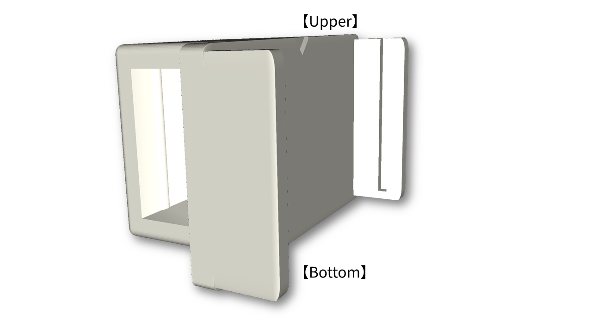

# micro:bit & Battery Integrated Holder 

## 概要 / Overview

micro:bitと電池ボックス（単4乾電池2本使用）を一体化するための、3Dプリントで製作可能なホルダーです。
電池ボックスを下側に配置することで、手で持ちやすく、無線コントローラ用途などに適した形状になっています。
また、ホルダー装着時でもmicro:bitのリセットボタンを押すことができ、エッジコネクターにはワニ口クリップを接続できます。

This is a 3D-printable holder designed to integrate a micro:bit and its battery box (powered by two AAA batteries) into a single unit.
By placing the battery box on the lower side, the design improves grip and usability, making it suitable for applications such as wireless controllers.
Even when the holder is attached, the reset button of the micro:bit remains accessible, and crocodile clips can be connected to the edge connector.

---

## 対応機器 / Compatible Devices

* micro:bit V1 / V2
* 電池ボックス（単4電池×2）※ 以下で動作確認済み  
  Battery box (2 × AAA batteries), tested with the following:

  * Switch Education SEDU-052771（スイッチ付き / with on/off switch）  
    https://switch-education.com/products/microbit-battery-cage/

  * RS Components MEFBATSV1SW（Micro:bit Educational Foundation純正アクセサリ、スイッチ付き / official micro:bit accessory with on/off switch）  
    https://jp.rs-online.com/web/p/bbc-micro-bit-add-ons/2648952

  * RS Components MEFBATUV1（Micro:bit Educational Foundation純正アクセサリ、スイッチなし / official micro:bit accessory without on/off switch）  
    https://jp.rs-online.com/web/p/bbc-micro-bit-add-ons/2648953

同様のサイズ・形状の電池ボックスでも使用できる可能性がありますが、寸法や形状には製品ごとの差があるため、すべての製品での互換性を保証するものではありません。

Battery boxes with similar dimensions and shape may also be compatible; however, compatibility with all products is not guaranteed due to variations in dimensions and design.

---

## 使用方法 / Usage

micro:bitは上側のスロットに挿入し、電池ボックスは下側のホルダー部に押し込んで固定します。
詳細な使用方法は以下の動画をご参照ください。

Insert the micro:bit into the upper slot, and press-fit the battery box into the lower holder.
See the video below for a demonstration of assembly and usage.

YouTube: https://youtu.be/INEASrIYd4c

---

## 印刷条件 / Printing Instructions

### 推奨設定 / Recommended Settings

* 印刷方式：FDM

* 材料：PLA（検証済み）

* サポート材：**必要**

* 単位：mm

* Printing method: FDM

* Material: PLA (tested)

* Support material: **Required**

* Unit: millimeters (mm)

---

### 印刷方向 / Print Orientation

推奨印刷方向は以下の画像を参照してください。
micro:bitのスロットの奥側（挿入時に突き当たる側）を下として配置してください。

Please refer to the image below for the recommended print orientation.
The bottom is defined as the end of the micro:bit insertion slot, where the board stops.

---

## ファイル / Files

* `model_plain.stl`：ロゴなし / without KIT logo (standard version)

* `model_logo.stl`：KITロゴ入り / with KIT logo (branded version)
  
---

## 特徴 / Features

* micro:bitと電池ボックスを一体化

* 下側に電池ボックスを配置することで持ちやすい形状

* 無線コントローラ用途に適した設計

* シンプルな差し込み構造（micro:bit：上側スロット、電池ボックス：下側ホルダー）

* Integrates the micro:bit and battery box into one unit

* Improved grip by placing the battery box on the lower side

* Suitable for wireless controller applications

* Simple insertion structure (micro:bit: upper slot, battery box: lower holder)

---

## 注意事項 / Notes

* サポート材の使用を前提としています

* プリンタや設定により仕上がりが異なる場合があります

* フィット感はプリンタ精度に依存するため、必要に応じてスケール調整を行ってください

* Support structures are required

* Print results may vary depending on printer settings

* Fit tolerance may vary depending on printer accuracy; adjust scaling if necessary

---

## ライセンス / License

* 本モデルはCC BY 4.0ライセンスで公開されています

* 使用・改変・再配布が可能です

* 本モデルを用いた造形物の販売も可能です

* ただし、再配布・販売時には出典を明記してください

* 記載例：

  * 作者：金沢工業大学 河並研究室
  * 出典：https://github.com/kawalab/microbit-battery-integrated-holder/
  * ライセンス：CC BY 4.0

* This work is licensed under the Creative Commons Attribution 4.0 International License

* You are free to use, modify, and redistribute this model

* You may also sell printed objects made from this model

* However, attribution is required when redistributing or selling

* Suggested attribution:

  * Author: Kawanami Lab, Kanazawa Institute of Technology
  * Source: https://github.com/kawalab/microbit-battery-integrated-holder/
  * License: CC BY 4.0

---

## 引用 / Citation

本モデルを研究用途で使用する場合は、本リポジトリを引用してください。

If you use this model in academic work, please cite this repository.

---

## 謝辞 / Acknowledgement

本モデルは研究および教育活動の一環として開発されました。

This model was developed as part of research and educational activities.
